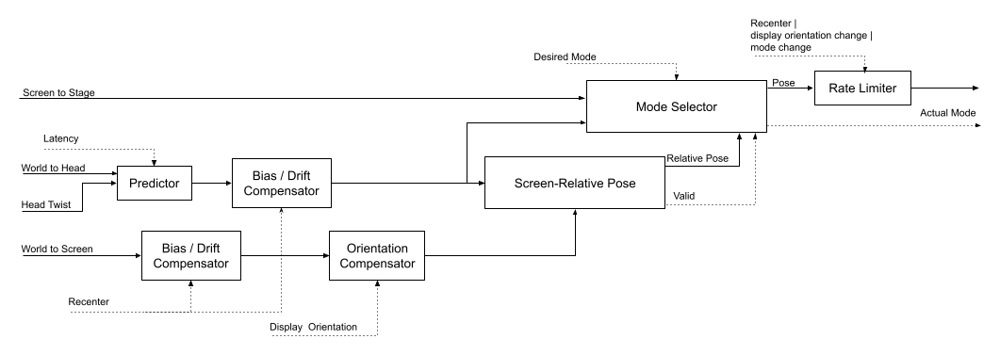

# Head-Tracking Library For Immersive Audio

This library handles the processing of head-tracking information, necessary for
Immersive Audio functionality. It goes from bare sensor reading into the final
pose fed into a virtualizer.

## Basic Usage

The main entry point into this library is the `HeadTrackingProcessor` class.
This class is provided with the following inputs:

- Head pose, relative to some arbitrary world frame.
- Screen pose, relative to some arbitrary world frame.
- Display orientation, defined as the angle between the "physical" screen and
  the "logical" screen.
- Transform between the screen and the sound stage.
- Desired operational mode:
    - Static: only the sound stage pose is taken into account. This will result
      in an experience where the sound stage moved with the listener's head.
    - World-relative: both the head pose and stage pose are taken into account.
      This will result in an experience where the sound stage is perceived to be
      located at a fixed place in the world.
    - Screen-relative: the head pose, screen pose and stage pose are all taken
      into account. This will result in an experience where the sound stage is
      perceived to be located at a fixed place relative to the screen.

Once inputs are provided, the `calculate()` method will make the following
output available:

- Stage pose, relative to the head. This aggregates all the inputs mentioned
  above and is ready to be fed into a virtualizer.
- Actual operational mode. May deviate from the desired one in cases where the
  desired mode cannot be calculated (for example, as result of dropped messages
  from one of the sensors).

A `recenter()` operation is also available, which indicates to the system that
whatever pose the screen and head are currently at should be considered as the
"center" pose, or frame of reference.

## Pose-Related Conventions

### Naming and Composition

When referring to poses in code, it is always good practice to follow
conventional naming, which highlights the reference and target frames clearly:

Bad:

```
Pose3f headPose;
```

Good:

```
Pose3f worldToHead;  // “world” is the reference frame,
                     // “head” is the target frame.
```

By following this convention, it is easy to follow correct composition of poses,
by making sure adjacent frames are identical:

```
Pose3f aToD = aToB * bToC * cToD;
```

And similarly, inverting the transform simply flips the reference and target:

```
Pose3f aToB = bToA.inverse();
```

### Twist

“Twist” is to pose what velocity is to distance: it is the time-derivative of a
pose, representing the change in pose over a short period of time. Its naming
convention always states one frame, e.g.:
Twist3f headTwist;

This means that this twist represents the head-at-time-T to head-at-time-T+dt
transform. Twists are not composable in the same way as poses.

### Frames of Interest

The frames of interest in this library are defined as follows:

#### Head

This is the listener’s head. The origin is at the center point between the
ear-drums, the X-axis goes from left ear to right ear, Y-axis goes from the back
of the head towards the face and Z-axis goes from the bottom of the head to the
top.

#### Screen

This is the primary screen that the user will be looking at, which is relevant
for some Immersive Audio use-cases, such as watching a movie. We will follow a
different convention for this frame than what the Sensor framework uses. The
origin is at the center of the screen. X-axis goes from left to right, Z-axis
goes from the screen bottom to the screen top, Y-axis goes “into” the screen (
from the direction of the viewer). The up/down/left/right of the screen are
defined as the logical directions used for display. So when flipping the display
orientation between “landscape” and “portrait”, the frame of reference will
change with respect to the physical screen.

#### Stage

This is the frame of reference used by the virtualizer for positioning sound
objects. It is not associated with any physical frame. In a typical
multi-channel scenario, the listener is at the origin, the X-axis goes from left
to right, Y-axis from back to front and Z-axis from down to up. For example, a
front-right speaker is located at positive X, Y and Z=0, a height speaker will
have a positive Z.

#### World

It is sometimes convenient to use an intermediate frame when dealing with
head-to-screen transforms. The “world” frame is an arbitrary frame of reference
in the physical world, relative to which we can measure the head pose and screen
pose. In (very common) cases when we can’t establish such an absolute frame, we
can take each measurement relative to a separate, arbitrary frame and high-pass
the result.

## Processing Description



The diagram above illustrates the processing that takes place from the inputs to
the outputs.

### Predictor

The Predictor block gets pose + twist (pose derivative) and extrapolates to
obtain a predicted head pose (w/ given latency).

### Drift / Bias Compensator

The Drift / Bias Compensator blocks serve two purposes:

- Compensate for floating reference axes by applying a high-pass filter, which
  slowly pulls the pose toward identity.
- Establish the reference frame for the poses by having the ability to set the
  current pose as the reference for future poses (recentering). Effectively,
  this is resetting the filter state to identity.

### Orientation Compensation

The Orientation Compensation block applies the display orientation to the screen
pose to obtain the pose of the “logical screen” frame, in which the Y-axis is
pointing in the direction of the logical screen “up” rather than the physical
one.

### Screen-Relative Pose

The Screen-Relative Pose block is provided with a head pose and a screen pose
and estimates the pose of the head relative to the screen. Optionally, this
module may indicate that the user is likely not in front of the screen via the
“valid” output.

### Mode Selector

The Mode Selector block aggregates the various sources of pose information into
a head-to-stage pose that is going to feed the virtualizer. It is controlled by
the “desired mode” signal that indicates whether the preference is to be in
either static, world-relative or screen-relative.

The actual mode may diverge from the desired mode. It is determined as follows:

- If the desired mode is static, the actual mode is static.
- If the desired mode is world-relative:
    - If head poses are fresh, the actual mode is world-relative.
    - Otherwise the actual mode is static.
- If the desired mode is screen-relative:
    - If head and screen poses are fresh and the ‘valid’ signal is asserted, the
      actual mode is screen-relative.
    - Otherwise, apply the same rules as the desired mode being world-relative.

### Rate Limiter

A Rate Limiter block is applied to the final output to smooth out any abrupt
transitions caused by any of the following events:

- Mode switch.
- Display orientation switch.
- Recenter operation.
